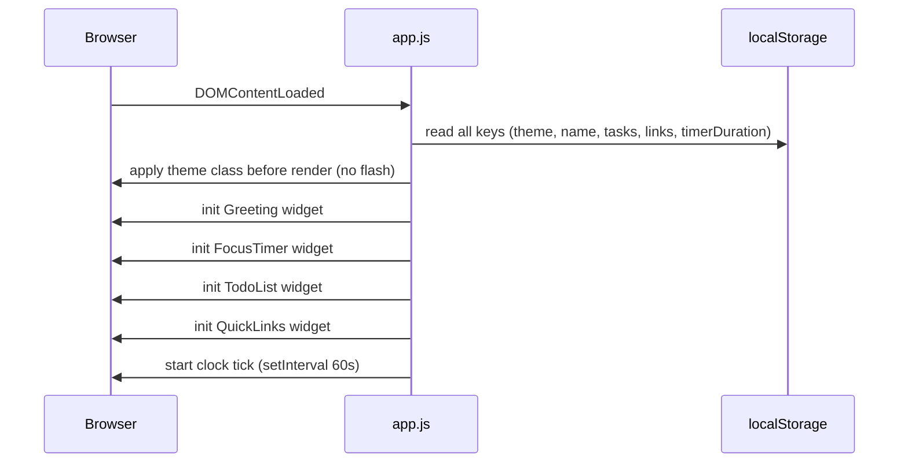

# Design Document: Personal Dashboard

## Overview

A single-page personal dashboard built with HTML, CSS, and Vanilla JavaScript. No build tools, no frameworks, no backend. All state is persisted to `localStorage`. The app is structured as one HTML file, one CSS file (`css/styles.css`), and one JS file (`js/app.js`).

The dashboard renders five widgets on load:
- Greeting (time, date, contextual message, custom name)
- Focus Timer (Pomodoro-style countdown)
- To-Do List (add, edit, complete, delete, duplicate prevention)
- Quick Links (add/delete URL shortcuts)
- Theme Toggle (light/dark, persisted)

All widgets are initialized from `localStorage` before first paint to avoid flash-of-default-content.

---

## Architecture

The app follows a simple module pattern inside a single JS file. There is no bundler or module system — everything runs in a single `<script>` block at the bottom of `<body>`. Each widget is a self-contained object with `init`, `render`, and `save` methods.

```
index.html
css/
  styles.css        ← all styles, CSS custom properties for theming
js/
  app.js            ← all logic, widget modules, localStorage helpers
```

### Initialization sequence



### Theme application

Theme is applied by toggling a `data-theme="dark"` attribute on `<html>`. CSS custom properties cascade from this selector. This ensures all elements inherit the correct palette without per-element class toggling.

---

## Components and Interfaces

### GreetingWidget

Responsible for: clock display, date display, contextual greeting, custom name input.

```
GreetingWidget
  .init()          → reads name from storage, renders, starts clock interval
  .render()        → updates time/date/greeting text in DOM
  .saveName(name)  → writes name to localStorage, re-renders
  .getGreeting()   → returns "Good morning" | "Good afternoon" | "Good evening"
```

Clock tick: `setInterval(render, 60_000)` started on init, aligned to the next full minute.

### FocusTimer

Responsible for: countdown display, start/stop/reset controls, session-complete notification.

```
FocusTimer
  .init()          → reads saved duration, renders initial state
  .start()         → begins setInterval(tick, 1000)
  .stop()          → clears interval, preserves remaining time
  .reset()         → clears interval, restores to session duration
  .tick()          → decrements remaining, re-renders; calls complete() at 00:00
  .complete()      → stops timer, shows notification banner
  .render()        → updates MM:SS display
```

State held in memory (not persisted between reloads — timer resets on reload by design).

### TodoList

Responsible for: task CRUD, duplicate detection, localStorage sync.

```
TodoList
  .init()          → loads tasks from storage, renders list
  .addTask(text)   → validates, checks duplicates, appends, saves, renders
  .editTask(id, newText) → validates, checks duplicates (excluding self), saves, renders
  .toggleTask(id)  → flips completed flag, saves, renders
  .deleteTask(id)  → removes from array, saves, renders
  .save()          → JSON.stringify tasks array → localStorage
  .render()        → rebuilds task list DOM from tasks array
  .isDuplicate(text, excludeId?) → case-insensitive match check
```

### QuickLinks

Responsible for: link CRUD, URL validation, localStorage sync.

```
QuickLinks
  .init()          → loads links from storage, renders
  .addLink(label, url) → validates label + URL, appends, saves, renders
  .deleteLink(id)  → removes, saves, renders
  .save()          → JSON.stringify links → localStorage
  .render()        → rebuilds link buttons DOM
```

URL validation uses the `URL` constructor: `new URL(value)` — throws on invalid input.

### ThemeManager

Responsible for: toggle, apply, persist theme.

```
ThemeManager
  .init()          → reads stored theme (default: "light"), applies
  .toggle()        → flips between "light" and "dark", saves, applies
  .apply(theme)    → sets data-theme attribute on <html>
  .save(theme)     → writes to localStorage
```

### StorageHelper

Thin wrapper around `localStorage` to centralize error handling.

```
StorageHelper
  .get(key, fallback)  → JSON.parse with try/catch; returns fallback on error
  .set(key, value)     → JSON.stringify with try/catch; emits warning on failure
```

---

## Data Models

All data is stored in `localStorage` as JSON strings under fixed keys.

### localStorage keys

| Key | Type | Description |
|-----|------|-------------|
| `pd_theme` | `"light" \| "dark"` | Current theme preference |
| `pd_name` | `string` | User's display name (may be empty string) |
| `pd_tasks` | `Task[]` | Serialized task array |
| `pd_links` | `Link[]` | Serialized quick links array |

### Task

```js
{
  id: string,          // crypto.randomUUID() or Date.now().toString()
  text: string,        // task description (trimmed)
  completed: boolean   // completion state
}
```

### Link

```js
{
  id: string,          // crypto.randomUUID() or Date.now().toString()
  label: string,       // display label (trimmed)
  url: string          // validated absolute URL
}
```

### Theme preference

Stored as a plain string: `"light"` or `"dark"`.

### Name

Stored as a plain string. Empty string means no name set.

---

## Correctness Properties

*A property is a characteristic or behavior that should hold true across all valid executions of a system — essentially, a formal statement about what the system should do. Properties serve as the bridge between human-readable specifications and machine-verifiable correctness guarantees.*

### Property 1: Time format is always HH:MM

*For any* `Date` object, the time-formatting function should return a string matching the pattern `\d{2}:\d{2}` (two digits, colon, two digits).

**Validates: Requirements 1.1**

---

### Property 2: Date format always contains day-of-week, month, and day number

*For any* `Date` object, the date-formatting function should return a string that contains a recognized day-of-week name, a recognized month name, and a numeric day.

**Validates: Requirements 1.2**

---

### Property 3: Contextual greeting is correct for all hours

*For any* hour value in [0, 23], `getGreeting(hour)` should return:
- `"Good morning"` when hour ∈ [5, 11]
- `"Good afternoon"` when hour ∈ [12, 17]
- `"Good evening"` when hour ∈ [18, 23] or [0, 4]

**Validates: Requirements 1.3, 1.4, 1.5**

---

### Property 4: Name persistence round-trip

*For any* non-empty string `name`, calling `saveName(name)` and then reading `StorageHelper.get("pd_name")` should return the same string. The rendered greeting should also contain `name`.

**Validates: Requirements 2.2, 2.3, 2.4**

---

### Property 5: Timer display format is always MM:SS

*For any* non-negative integer number of seconds `s` in [0, 5999], the timer-formatting function should return a string matching `\d{2}:\d{2}`.

**Validates: Requirements 3.1**

---

### Property 6: Timer reset restores session duration

*For any* session duration `d` (in seconds), starting the timer, ticking it one or more times, then calling `reset()` should restore the displayed remaining time to exactly `d`.

**Validates: Requirements 3.5**

---

### Property 7: Task persistence round-trip

*For any* valid (non-empty, non-duplicate) task text, calling `addTask(text)` should result in the task appearing in the in-memory task array AND in the JSON stored at `pd_tasks` in localStorage.

**Validates: Requirements 4.2, 4.3**

---

### Property 8: Task edit persistence

*For any* existing task and any new valid text (non-empty, non-duplicate), calling `editTask(id, newText)` should update the task's text in memory and persist the updated array to `pd_tasks`.

**Validates: Requirements 4.4**

---

### Property 9: Task completion toggle is an involution

*For any* task, calling `toggleTask(id)` twice should return the task's `completed` field to its original value, and the persisted state should match.

**Validates: Requirements 4.5**

---

### Property 10: Task deletion removes from list and storage

*For any* task list containing at least one task, calling `deleteTask(id)` should result in no task with that `id` appearing in the in-memory array or in the JSON stored at `pd_tasks`.

**Validates: Requirements 4.6**

---

### Property 11: Empty or whitespace task text is rejected

*For any* string composed entirely of whitespace characters (including the empty string), calling `addTask(text)` should reject the submission and leave the task list unchanged.

**Validates: Requirements 4.7**

---

### Property 12: Duplicate task add is rejected (case-insensitive)

*For any* existing task text `t` and any string `s` such that `s.trim().toLowerCase() === t.trim().toLowerCase()`, calling `addTask(s)` should reject the submission and leave the task list unchanged.

**Validates: Requirements 5.1, 5.2**

---

### Property 13: Duplicate task edit is rejected (case-insensitive)

*For any* task list with at least two tasks, editing one task to have text that case-insensitively matches another existing task should be rejected and leave both tasks unchanged.

**Validates: Requirements 5.3**

---

### Property 14: Link persistence round-trip

*For any* valid label string and valid URL string, calling `addLink(label, url)` should result in the link appearing in the in-memory links array AND in the JSON stored at `pd_links` in localStorage.

**Validates: Requirements 6.2, 6.4**

---

### Property 15: Link deletion removes from list and storage

*For any* links list containing at least one link, calling `deleteLink(id)` should result in no link with that `id` appearing in the in-memory array or in the JSON stored at `pd_links`.

**Validates: Requirements 6.5**

---

### Property 16: Invalid link input is rejected

*For any* input where the label is empty OR the URL is not parseable by `new URL()`, calling `addLink(label, url)` should reject the submission and leave the links list unchanged.

**Validates: Requirements 6.6**

---

### Property 17: Theme persistence round-trip

*For any* theme value in `{"light", "dark"}`, calling `ThemeManager.toggle()` (or `apply(theme)`) and then reading `StorageHelper.get("pd_theme")` should return the applied theme value, and the `data-theme` attribute on `<html>` should match.

**Validates: Requirements 7.3, 7.4**

---

## Error Handling

### localStorage unavailable

`StorageHelper.get` and `StorageHelper.set` wrap all calls in `try/catch`. On failure:
- `get` returns the provided fallback value (empty array, empty string, or `"light"`)
- `set` logs a `console.warn` and renders a non-blocking banner: `"Some data could not be saved."`

Widgets always render with whatever data is available — they never throw on missing storage.

### Invalid stored data

If `JSON.parse` produces an unexpected shape (e.g., `pd_tasks` contains a non-array), the widget falls back to an empty default. A defensive check (`Array.isArray`) guards task and link arrays before use.

### URL validation

`addLink` wraps `new URL(value)` in a try/catch. Any thrown `TypeError` is treated as an invalid URL and surfaces an inline validation message without modifying state.

### Empty / whitespace input

All text inputs are `.trim()`-ed before validation. Empty strings after trimming are rejected with an inline message. The input field retains focus so the user can correct the entry.

### Timer edge cases

- If the timer reaches 0 and `tick()` is called again (race condition), remaining is clamped to 0 and `complete()` is idempotent.
- `reset()` clears any active interval before restoring state to prevent double-tick.

---

## Testing Strategy

### Dual approach

Both unit tests and property-based tests are required. They are complementary:
- Unit tests cover specific examples, integration points, and edge cases.
- Property tests verify universal correctness across many generated inputs.

### Property-based testing library

Use **fast-check** (JavaScript) for all property-based tests. Each property test runs a minimum of **100 iterations**.

Each property test must be tagged with a comment in this format:
```
// Feature: personal-dashboard, Property N: <property text>
```

### Unit tests (specific examples and edge cases)

- Greeting widget renders with correct DOM structure (Req 2.1)
- Focus timer defaults to 25:00 with no stored duration (Req 3.2)
- Timer starts counting down after `start()` (Req 3.3)
- Timer pauses after `stop()` (Req 3.4)
- Timer fires completion notification at 00:00 (Req 3.6)
- Todo list renders input and submit control (Req 4.1)
- Quick Links renders label/URL inputs and submit control (Req 6.1)
- Theme toggle applies correct `data-theme` attribute (Req 7.2)
- Theme defaults to `"light"` with no stored preference (Req 7.5)
- StorageHelper returns fallback when localStorage throws (Req 8.3)

### Property tests (one test per property)

| Property | Test description |
|----------|-----------------|
| P1 | `fc.date()` → time formatter → matches `/^\d{2}:\d{2}$/` |
| P2 | `fc.date()` → date formatter → contains day name, month name, day number |
| P3 | `fc.integer({min:0, max:23})` → `getGreeting()` → correct string |
| P4 | `fc.string({minLength:1})` → `saveName()` → storage round-trip + greeting contains name |
| P5 | `fc.integer({min:0, max:5999})` → timer formatter → matches `/^\d{2}:\d{2}$/` |
| P6 | `fc.integer({min:60, max:5999})` → start + N ticks + reset → remaining === duration |
| P7 | `fc.string({minLength:1})` → `addTask()` → task in array and in `pd_tasks` JSON |
| P8 | existing task + `fc.string({minLength:1})` → `editTask()` → updated in array and storage |
| P9 | any task → `toggleTask()` twice → `completed` unchanged, storage matches |
| P10 | task list + any task id → `deleteTask()` → id absent from array and storage |
| P11 | `fc.stringMatching(/^\s*$/)` → `addTask()` → rejected, list unchanged |
| P12 | existing task text + case variant → `addTask()` → rejected, list unchanged |
| P13 | two-task list + edit to match other → `editTask()` → rejected, both unchanged |
| P14 | `fc.string({minLength:1})` + valid URL → `addLink()` → link in array and `pd_links` JSON |
| P15 | links list + any link id → `deleteLink()` → id absent from array and storage |
| P16 | empty label or invalid URL string → `addLink()` → rejected, list unchanged |
| P17 | `fc.constantFrom("light","dark")` → `apply()` → storage and `data-theme` match |

### Test file structure

```
tests/
  greeting.test.js
  timer.test.js
  todo.test.js
  quicklinks.test.js
  theme.test.js
  storage.test.js
```

Tests use a lightweight test runner (e.g., Vitest or Jest) with jsdom for DOM access, and fast-check for property generation.
